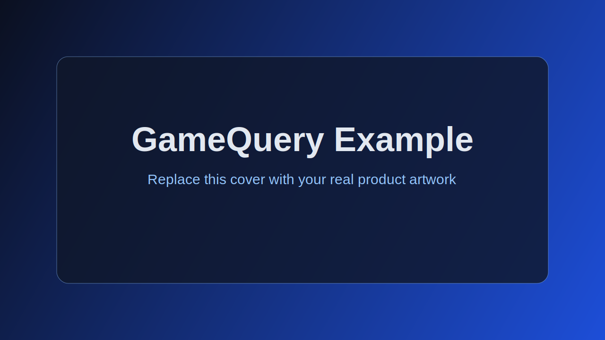
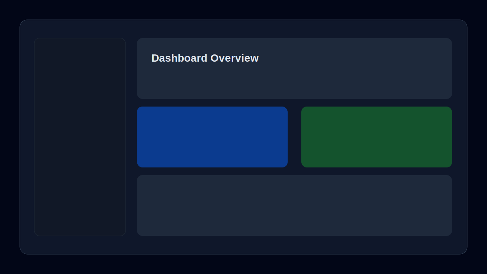

# GameQuery Example

A reference repository template for GameQuery Community Market submissions.
Fork this project and replace the sample content with your real app details.



## Screenshots




## Description

This section should explain what your app does, who it is for, and what problem it solves.
The first meaningful paragraph is used by GameQuery to auto-fill the marketplace description.

## Key Features

- Real-time game server tracking and smart filtering
- Lightweight admin dashboard with API usage analytics
- One-click export for setup and migration workflows

## Built With

- Platform (e.g., Discord, WordPress, IPB, phpBB)
- Primary language used (JS, PHP, or Python)

## Preview URL

- https://your-preview-url.example.com

## System Requirements

- Add one requirement per line (e.g., WordPress 6.0+, PHP 7.4+, Node.js 18+)

## Quick Start

```bash
npm install
npm run dev
```

## Community Market Checklist

- Public repository (not archived)
- `README.md` present and descriptive
- Preview URL included in `README.md`
- System requirements listed in `README.md`
- `CHANGELOG.md` present with version sections
- SPDX license detected (`LICENSE` file)
- Images included in `README.md` (recommended for cover/gallery import)

## License

This example uses the MIT license. Replace it with the license that matches your project.
